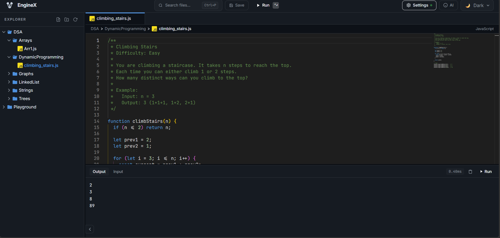
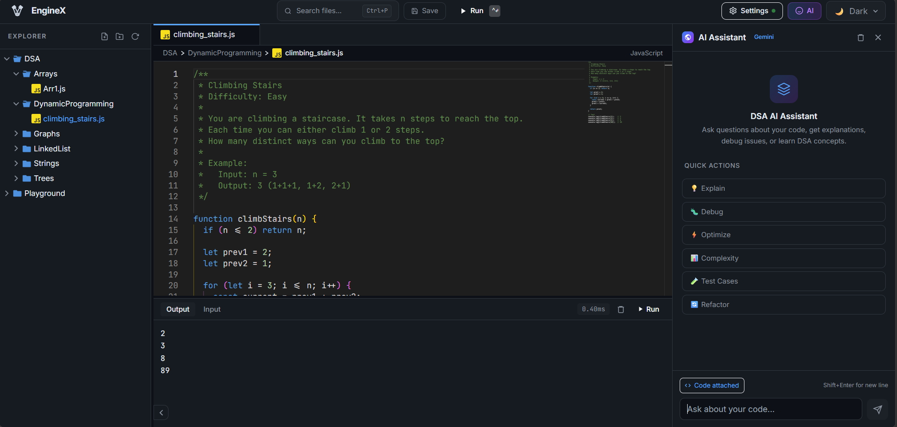

# EngineCodeX
node 
EngineCodeX is a modern, web-based code editor and DSA playground with integrated AI assistance. Built with React, Vite, Monaco Editor, Node.js/Express backend, and Google Gemini AI integration.

## Features

- Syntax-highlighted code editor with multi-tab support (Monaco Editor)
- Resizable file explorer sidebar with search
- Integrated terminal/console
- AI code assistant panel (Gemini-powered)
- Theme support with auto-save and session restore
- Keyboard shortcuts for productivity
- Pre-loaded DSA workspace with common algorithm examples (Arrays, Graphs, Trees, etc.)
- Real-time file management via API
- Responsive layout with drag-to-resize panels

## Screenshots

| Editor Interface |
|------------------|
|  |


| AI Assistant |
|--------------|
|  | <!-- Reuse s1 or add s3.png -->


(Add your screenshots and demo GIF to `screenshots/` and root for best display)

## Quick Start

### Prerequisites

- Node.js 18+
- Google Gemini API key (optional for AI features)

### Setup

1. Clone the repository:
   ```bash
   git clone <repo-url>
   cd EngineCodeX
   ```

2. Install dependencies:

   **Client:**
   ```bash
   cd client
   npm install
   cd ..
   ```

   **Server:**
   ```bash
   cd server
   npm install
   cd ..
   ```

3. Configure AI (optional):
   Create `server/.env`:
   ```
   GEMINI_API_KEY=your_gemini_api_key_here
   ```

4. Run the application:

   **Development:**
   Terminal 1 (client):
   ```bash
   cd client
   npm run dev
   ```

   Terminal 2 (server):
   ```bash
   cd server
   npm start
   ```

   Open http://localhost:5173

   **Production build:**
   ```bash
   cd client
   npm run build
   npm run preview  # Preview build
   ```

## Project Structure

```
EngineCodeX/
├── client/                 # React/Vite frontend
│   ├── src/
│   │   ├── components/     # Editor, FileManager, Console, AI, UI
│   │   ├── stores/         # Zustand state management
│   │   ├── hooks/          # Custom hooks (autosave, shortcuts)
│   │   └── utils/          # Helpers
│   ├── public/assets/      # Logo, images
│   └── vite.config.js
├── server/                 # Node/Express API
│   ├── routes/             # /api/files, /api/ai
│   ├── workspace/DSA/      # Sample algo files
│   └── index.js
├── .gitignore              # Node/Vite ignores
└── README.md
```

## API Endpoints

- `GET/POST /api/files/**` - File operations, workspace management
- `POST /api/ai/**` - AI code suggestions/completions
- `GET /api/health` - Server status

## Keyboard Shortcuts

| Key          | Action                  |
|--------------|-------------------------|
| `Ctrl+S`     | Save file               |
| `Ctrl+N`     | New file                |
| `Ctrl+O`     | Open file               |
| `Ctrl+Shift+P` | Toggle AI panel      |
| `Ctrl+``     | Toggle console          |
| `Ctrl+B`     | Toggle sidebar          |

## Development

- Client: `npm run dev` (Vite HMR on :5173)
- Server: `npm start` (Express on :3001)
- Build: `npm run build` (client/dist)

Uses TailwindCSS, Monaco Editor, Zustand for state.

## DSA Workspace

Pre-seeded with:
- Arrays: Basic operations
- Graphs: Number of islands
- Trees: Level order traversal
- Linked Lists, Strings, Dynamic Programming

Extend in `server/workspace/`.

## Contributing

1. Fork the repo
2. Create feature branch (`git checkout -b feature/AmazingFeature`)
3. Commit changes (`git commit -m 'Add some AmazingFeature'`)
4. Push (`git push origin feature/AmazingFeature`)
5. Open Pull Request

## License

MIT
